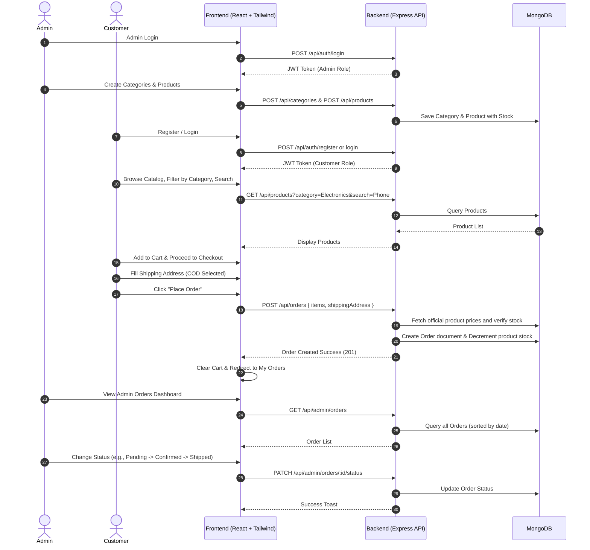

# 🛒 Mini E-Commerce Demo Project (MERN Stack)

A clean, modern, and production-ready architecture specification for a **Mini E-Commerce Demo** built with the **MERN Stack** (MongoDB, Express.js, React.js, Node.js), styled with **Tailwind CSS**, and secured with **JWT + bcrypt**.

---

## 📌 Table of Contents

- [Project Overview](#-project-overview)
- [Tech Stack](#-tech-stack)
- [Project Architecture](#-project-architecture)
- [Directory Structure](#-directory-structure)
- [Core Features](#-core-features)
  - [1. Authentication & Authorization](#1-authentication--authorization)
  - [2. Public Storefront](#2-public-storefront)
  - [3. Shopping Cart](#3-shopping-cart)
  - [4. Checkout & Order Processing](#4-checkout--order-processing)
  - [5. Admin Dashboard](#5-admin-dashboard)
- [Database Models](#-database-models)
- [API Overview](#-api-overview)
- [Security & Validation Rules](#-security--validation-rules)
- [Main Demo Flow](#-main-demo-flow)
- [Documentation Index](#-documentation-index)

---

## 🚀 Project Overview

The **Mini E-Commerce Demo Project** is designed to provide an end-to-end shopping experience while remaining lean, focused, and maintainable. It focuses on the core foundations of modern e-commerce web applications:

- **Customer Journey:** Authentication, product catalog browsing, category filtering, search, cart management, checkout with Cash on Delivery (COD), and real-time order history.
- **Admin Control:** Catalog management (Categories & Products with stock levels) and order lifecycle management (Pending → Confirmed → Shipped → Delivered / Cancelled).
- **Security-First Architecture:** Server-side pricing verification, atomic stock updates, JWT authentication, and role-based access control.

---

## 💻 Tech Stack

| Layer | Technology | Description |
| :--- | :--- | :--- |
| **Frontend Framework** | **React.js (v18+)** | Component-driven UI library |
| **Build Tool** | **Vite** | Fast development server and bundler |
| **Language** | **JavaScript (ES6+)** | Frontend and backend programming language |
| **Styling** | **Tailwind CSS** | Utility-first responsive CSS framework |
| **Backend Framework** | **Node.js + Express.js** | Fast, minimalist RESTful API server |
| **Database** | **MongoDB** | NoSQL document database |
| **ODM** | **Mongoose** | Schema validation and business logic modeling |
| **Authentication** | **JWT (JSON Web Tokens)** | Stateless token-based authentication |
| **Password Security** | **bcryptjs** | Salt hashing for secure credential storage |
| **HTTP Client** | **Axios** | Promise-based HTTP requests with interceptors |

---

## 📐 Project Architecture

```mermaid
graph TD
    subgraph Client ["Client (React + Vite + Tailwind CSS)"]
        UI[Public Storefront & Pages]
        AdminUI[Admin Dashboard & Tables]
        CartState[Cart Context / State]
        AuthState[Auth Context / Token Storage]
        AxiosClient[Axios API Client]
    end

    subgraph Server ["Server (Node.js + Express.js REST API)"]
        Router[Express Routers]
        AuthMW[Auth Middleware (JWT Verify)]
        AdminMW[Admin Role Guard]
        Controllers[API Controllers]
        Validation[Input Validation]
    end

    subgraph Database ["Database (MongoDB via Mongoose)"]
        Users[(Users Collection)]
        Categories[(Categories Collection)]
        Products[(Products Collection)]
        Orders[(Orders Collection)]
    end

    UI --> AxiosClient
    AdminUI --> AxiosClient
    AxiosClient -->|HTTP Requests + Bearer Token| Router

    Router --> AuthMW
    AuthMW --> AdminMW
    AuthMW --> Controllers
    AdminMW --> Controllers
    Controllers --> Validation
    Validation --> Database
```

---

## 📂 Directory Structure

The project follows a clean separation of concerns between client and server:

```text
E-com/
├── README.md
├── docs/
│   ├── ARCHITECTURE.md          # Complete system architecture and data flows
│   ├── API_SPECIFICATION.md     # Detailed REST API endpoints, schemas, payloads
│   ├── DATABASE_MODELS.md       # Mongoose schemas, relationships, indexing
│   ├── FRONTEND_SPECIFICATION.md# UI layouts, pages, components, and Tailwind design
│   ├── WORKFLOW_AND_SECURITY.md # Validation, security rules, and end-to-end demo flow
│   └── IMPLEMENTATION_ROADMAP.md# Step-by-step phased development plan
│
├── client/                      # React Frontend (Vite)
│   ├── index.html
│   ├── package.json
│   ├── vite.config.js
│   ├── tailwind.config.js
│   ├── postcss.config.js
│   └── src/
│       ├── assets/              # Static assets, logos, icons
│       ├── components/          # Reusable UI elements (Navbar, Footer, Modal, Card, Toast)
│       │   ├── common/
│       │   ├── admin/
│       │   └── shop/
│       ├── context/             # Global state (AuthContext, CartContext)
│       ├── hooks/               # Custom React hooks
│       ├── pages/               # Main route views
│       │   ├── Home.jsx
│       │   ├── Products.jsx
│       │   ├── ProductDetails.jsx
│       │   ├── Cart.jsx
│       │   ├── Checkout.jsx
│       │   ├── Login.jsx
│       │   ├── Register.jsx
│       │   ├── MyOrders.jsx
│       │   └── admin/
│       │       ├── AdminDashboard.jsx
│       │       ├── AdminCategories.jsx
│       │       ├── AdminProducts.jsx
│       │       └── AdminOrders.jsx
│       ├── services/            # Axios API instances and service methods
│       ├── utils/               # Formatters, constants, helpers
│       ├── App.jsx
│       ├── index.css            # Tailwind directives and custom utility rules
│       └── main.jsx
│
└── server/                      # Node.js + Express Backend
    ├── package.json
    ├── .env.example
    ├── server.js                # App entrypoint & HTTP listener
    └── src/
        ├── config/              # Database connection (db.js)
        ├── controllers/         # Request handling logic
        │   ├── authController.js
        │   ├── categoryController.js
        │   ├── productController.js
        │   └── orderController.js
        ├── middleware/          # Security and auth middleware
        │   ├── authMiddleware.js
        │   ├── adminMiddleware.js
        │   └── errorMiddleware.js
        ├── models/              # Mongoose data models
        │   ├── User.js
        │   ├── Category.js
        │   ├── Product.js
        │   └── Order.js
        ├── routes/              # Express route declarations
        │   ├── authRoutes.js
        │   ├── categoryRoutes.js
        │   ├── productRoutes.js
        │   └── orderRoutes.js
        └── utils/               # Token generator, validation helpers
```

---

## 🌟 Core Features

### 1. Authentication & Authorization
- **Customer Registration & Login**: Validates Name, Email, Password, and Confirm Password. Minimum 6 characters for passwords.
- **Admin Authentication**: Privileged login verifying `role: "admin"` flag.
- **Stateless Tokens**: JWTs issued upon successful authentication, transmitted in the `Authorization: Bearer <token>` header.
- **Route Protection**: Dedicated `authMiddleware` for customer routes and `adminMiddleware` for administrative access.

### 2. Public Storefront
- **Responsive Navigation**: Brand logo, search bar, navigation links, cart badge count, and user/admin dropdown.
- **Hero Banner & Category Showcase**: Engaging visual introduction with quick links to categories.
- **Dynamic Catalog**:
  - Filter by category (e.g., *All | Electronics | Fashion | Shoes*).
  - Real-time search query matching product name and description.
  - Clean card grid displaying image, title, price, category badge, stock status, and "Add to Cart" action.
- **Product Details Page**: High-resolution image, full description, availability badge, quantity selector, and instant purchase options.

### 3. Shopping Cart
- Client-side persistent cart synchronized with local storage.
- Quantity adjustment controls (+ / -) with automatic stock boundary enforcement (cannot exceed in-stock quantity).
- Item removal with confirmation feedback.
- Real-time order subtotal calculation.

### 4. Checkout & Order Processing
- **Shipping Address Form**: Full Name, Phone Number, Street Address, City, and Pincode.
- **Payment Mode**: Exclusive support for **Cash on Delivery (COD)**.
- **Server-Side Price Validation**: Never trusts the cart prices submitted by the client; automatically fetches authoritative prices from MongoDB.
- **Stock Synchronization**: Checks item availability and decrements product inventory upon order confirmation.
- **Order Tracking**: Customers can inspect order status (*Pending, Confirmed, Shipped, Delivered, Cancelled*) under **My Orders**.

### 5. Admin Dashboard
- **Category Management**: Create, Read, Update, Delete (CRUD) categories with name and description.
- **Product Management**: Full CRUD capabilities for products (Title, Description, Price, Image URL, Category selection, and Stock).
- **Order Management**: Comprehensive tabular listing of all customer orders, full breakdown of items and shipping information, and dynamic status updates.

---

## 🗄 Database Models

The database consists of **4 strictly defined collections**:

| Model | Key Fields | Description |
| :--- | :--- | :--- |
| **User** | `name`, `email`, `password`, `role` (`"customer"` \| `"admin"`), `createdAt` | Accounts for customers and store administrators |
| **Category** | `name`, `description`, `createdAt` | Product groupings for filtering and organization |
| **Product** | `name`, `description`, `price`, `image`, `category` (Ref), `stock`, `createdAt` | Store merchandise catalog items |
| **Order** | `user` (Ref), `products` [item, qty, price, name, image], `totalAmount`, `shippingAddress`, `status`, `createdAt` | Placed customer orders and fulfillment status |

*See [DATABASE_MODELS.md](docs/DATABASE_MODELS.md) for full schema definitions.*

---

## 🔌 API Overview

All routes are prefixed under `/api`.

| Method | Endpoint | Access | Description |
| :--- | :--- | :--- | :--- |
| **POST** | `/api/auth/register` | Public | Register new customer |
| **POST** | `/api/auth/login` | Public | Authenticate user & issue JWT |
| **GET** | `/api/categories` | Public | Retrieve all categories |
| **POST** | `/api/categories` | Admin | Create category |
| **PUT** | `/api/categories/:id` | Admin | Update category |
| **DELETE**| `/api/categories/:id` | Admin | Remove category |
| **GET** | `/api/products` | Public | List products (with `?category=` & `?search=`) |
| **GET** | `/api/products/:id` | Public | Retrieve single product details |
| **POST** | `/api/products` | Admin | Create new product |
| **PUT** | `/api/products/:id` | Admin | Update product |
| **DELETE**| `/api/products/:id` | Admin | Remove product |
| **POST** | `/api/orders` | Customer | Place order (Validates stock & calculates price) |
| **GET** | `/api/orders/my-orders` | Customer | List logged-in user's orders |
| **GET** | `/api/admin/orders` | Admin | Retrieve all customer orders |
| **PATCH**| `/api/admin/orders/:id/status`| Admin | Update status (*Pending/Confirmed/Shipped/Delivered/Cancelled*) |

*See [API_SPECIFICATION.md](docs/API_SPECIFICATION.md) for complete contract documentation.*

---

## 🔒 Security & Validation Rules

1. **Price Verification**: Client-provided prices are ignored during checkout. Product prices are looked up directly from MongoDB by `productId`.
2. **Stock Guard**: Orders cannot be placed if requested quantity exceeds current product stock. Stock is atomically decremented upon order creation.
3. **Encrypted Passwords**: Stored as salted hashes using `bcryptjs` (salt rounds: 10).
4. **JWT Verification**: Protected endpoints require a valid token signed with `JWT_SECRET`.
5. **Input Sanitization**: Strings trimmed, email validated with standard regex, numerical values validated to be non-negative (`price > 0`, `stock >= 0`).

---

## 🔄 Main Demo Flow



---

## 📚 Documentation Index

For in-depth technical details, please refer to the documents in the `docs/` folder:

- 🏗️ **[System Architecture](docs/ARCHITECTURE.md)**: Component diagrams, flow mechanisms, and state management.
- 📡 **[API Specification](docs/API_SPECIFICATION.md)**: Full endpoint definitions, request/response bodies, status codes, and error formats.
- 💾 **[Database Models](docs/DATABASE_MODELS.md)**: Complete Mongoose schema code specifications, validation rules, and indexes.
- 🎨 **[Frontend & UI Specification](docs/FRONTEND_SPECIFICATION.md)**: Pages, components, Tailwind design system, modals, and toasts.
- 🛡️ **[Workflows & Security](docs/WORKFLOW_AND_SECURITY.md)**: Security rules, stock verification logic, and end-to-end user journeys.
- 🗺️ **[Implementation Roadmap](docs/IMPLEMENTATION_ROADMAP.md)**: Step-by-step phased plan for project execution.