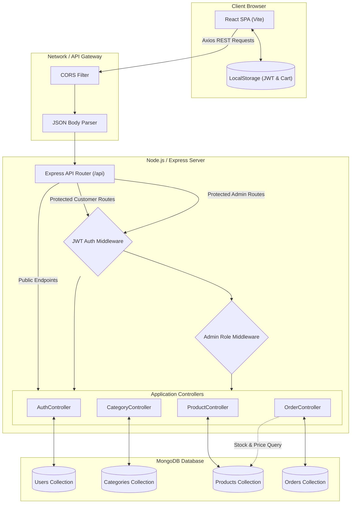
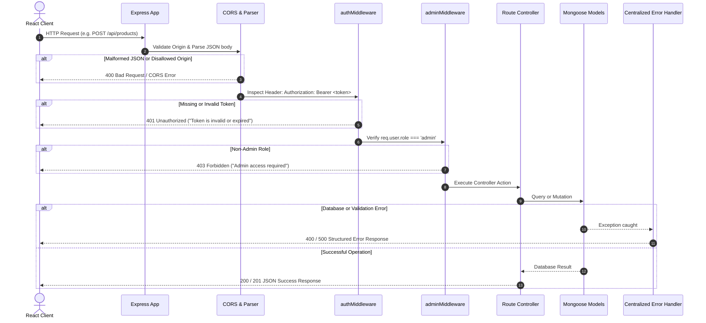

# 🏗️ System Architecture Specification

This document details the architectural design, component interactions, security boundaries, and data pipelines for the **Mini E-Commerce Demo Project (MERN Stack)**.

---

## 📋 Table of Contents

- [1. High-Level Architecture Overview](#1-high-level-architecture-overview)
- [2. Layered Architecture Breakdown](#2-layered-architecture-breakdown)
  - [2.1 Client Layer (Frontend)](#21-client-layer-frontend)
  - [2.2 Server Layer (Backend API)](#22-server-layer-backend-api)
  - [2.3 Database Layer (Data Persistence)](#23-database-layer-data-persistence)
- [3. Request-Response Pipeline & Middleware Chain](#3-request-response-pipeline--middleware-chain)
- [4. Authentication & Authorization Flow](#4-authentication--authorization-flow)
- [5. State Management Architecture](#5-state-management-architecture)
- [6. Order & Inventory Synchronization Pipeline](#6-order--inventory-synchronization-pipeline)
- [7. Error Handling & Logging Strategy](#7-error-handling--logging-strategy)

---

## 1. High-Level Architecture Overview

The system adopts a decoupled client-server architecture utilizing RESTful conventions over HTTPS. The frontend client is a single-page application (SPA) built using React.js and Vite, while the backend is an Express.js service interfacing with a MongoDB cluster.



---

## 2. Layered Architecture Breakdown

### 2.1 Client Layer (Frontend)

- **Technology**: React 18+ bundled with Vite.
- **Styling**: Tailwind CSS with custom theme variables for responsive design across mobile, tablet, and desktop screens.
- **Routing**: Client-side routing with `react-router-dom`:
  - **Public Routes**: Home (`/`), Products Catalog (`/products`), Product Details (`/products/:id`), Login (`/login`), Register (`/register`).
  - **Customer Protected Routes**: Cart (`/cart`), Checkout (`/checkout`), Order History (`/my-orders`).
  - **Admin Protected Routes**: Admin Dashboard (`/admin`), Admin Categories (`/admin/categories`), Admin Products (`/admin/products`), Admin Orders (`/admin/orders`).
- **HTTP Client**: Axios with configured base URL, request interceptors (attaching `Bearer <token>`), and response interceptors (handling 401 unauthorized errors).

### 2.2 Server Layer (Backend API)

- **Runtime**: Node.js (LTS version).
- **Framework**: Express.js configured with modular routing:
  - `/api/auth`: Handles user registration, authentication, and session identity.
  - `/api/categories`: Category CRUD operations.
  - `/api/products`: Product catalog listing, category filtering, search queries, and management.
  - `/api/orders`: Order placement, user order lookups, and admin status updates.
- **Middleware Infrastructure**:
  - `cors`: Cross-Origin Resource Sharing configuration.
  - `express.json()`: Built-in request body parser.
  - `authMiddleware`: Cryptographic JWT verification and user payload extraction.
  - `adminMiddleware`: Checks for `role === 'admin'` before granting access to privileged resources.
  - `errorHandler`: Centralized error catching and uniform JSON error payload response.

### 2.3 Database Layer (Data Persistence)

- **Database**: MongoDB (v6.0+).
- **Object Data Modeling (ODM)**: Mongoose.
- **Design Highlights**:
  - Normalized relationships using Mongoose `ObjectId` references (`ref: 'User'`, `ref: 'Category'`).
  - Snapshotting within orders: Historical product title, unit price, and image are preserved directly inside the `Order.products` subdocuments to ensure historical fidelity even if products are edited or deleted later.
  - Indexing: `email` unique index on User; text/string indexing on Product `name` and `category` for fast searches and category filtering.

---

## 3. Request-Response Pipeline & Middleware Chain

Every incoming HTTP request undergoes a standardized pipeline before reaching the target business logic:



---

## 4. Authentication & Authorization Flow

```mermaid
flowchart TD
    Start([User attempts Login/Register]) --> InputCreds[Submit Email & Password]
    InputCreds --> ServerValidate{Server checks fields}
    
    ServerValidate -- Invalid --> Return400[Return 400 Validation Error]
    ServerValidate -- Valid --> CheckUser{Check Email in DB}

    CheckUser -- Registration & Exists --> UserConflict[Return 400 'Email already registered']
    CheckUser -- Login & Not Found --> AuthFail[Return 401 'Invalid credentials']
    
    CheckUser -- Login & Found --> CompareHash{bcrypt.compare password}
    CompareHash -- Mismatch --> AuthFail
    CompareHash -- Match --> GenJWT[Generate JWT Token with userId & role]

    CheckUser -- Registration & New --> HashPassword[bcrypt.hash password with salt 10]
    HashPassword --> CreateUser[Save User to MongoDB]
    CreateUser --> GenJWT

    GenJWT --> SendResponse[Return 200/201: { token, user: { id, name, email, role } }]
    SendResponse --> ClientSave[Client stores Token in LocalStorage & Context]
    ClientSave --> RedirectRoute{Role?}
    RedirectRoute -- admin --> DashAdmin[Redirect to /admin]
    RedirectRoute -- customer --> DashShop[Redirect to / or previous page]
```

### Authorization Boundaries

| Path Pattern | Access Level | Middleware Required |
| :--- | :--- | :--- |
| `/api/auth/**` | Public | None |
| `GET /api/categories` | Public | None |
| `GET /api/products/**` | Public | None |
| `POST /api/orders` | Customer | `authMiddleware` |
| `GET /api/orders/my-orders` | Customer | `authMiddleware` |
| `POST /api/categories` | Admin Only | `authMiddleware` + `adminMiddleware` |
| `PUT /api/categories/:id` | Admin Only | `authMiddleware` + `adminMiddleware` |
| `DELETE /api/categories/:id` | Admin Only | `authMiddleware` + `adminMiddleware` |
| `POST /api/products` | Admin Only | `authMiddleware` + `adminMiddleware` |
| `PUT /api/products/:id` | Admin Only | `authMiddleware` + `adminMiddleware` |
| `DELETE /api/products/:id` | Admin Only | `authMiddleware` + `adminMiddleware` |
| `GET /api/admin/orders` | Admin Only | `authMiddleware` + `adminMiddleware` |
| `PATCH /api/admin/orders/:id/status` | Admin Only | `authMiddleware` + `adminMiddleware` |

---

## 5. State Management Architecture

The frontend leverages React Context API for global, decoupled state management without the overhead of heavy third-party state stores:

### 1. `AuthContext`
- **State**:
  - `user`: `{ id, name, email, role }` or `null`.
  - `token`: String JWT or `null`.
  - `isAuthenticated`: Boolean flag.
  - `isAdmin`: Boolean flag (`user?.role === 'admin'`).
  - `loading`: Boolean state while initializing auth from `localStorage`.
- **Methods**:
  - `login(email, password)`
  - `register(name, email, password, confirmPassword)`
  - `logout()`

### 2. `CartContext`
- **State**:
  - `cartItems`: Array of `{ product: productId, name, price, image, stock, quantity }`.
  - `totalCount`: Total number of units in cart.
  - `totalPrice`: Estimated subtotal for cart review.
- **Methods**:
  - `addToCart(product, quantity)`: Appends item or increments quantity, capped by available `stock`.
  - `updateQuantity(productId, quantity)`: Modifies quantity within bounds `[1, stock]`.
  - `removeFromCart(productId)`: Removes line item.
  - `clearCart()`: Wipes cart upon successful order placement.
- **Persistence**: Synchronized with `localStorage` on every change (`localStorage.setItem('cartItems', ...)`).

---

## 6. Order & Inventory Synchronization Pipeline

The checkout flow protects inventory integrity and eliminates price tampering:

```mermaid
flowchart TD
    SubmitOrder([Customer clicks 'Place Order']) --> ClientPayload[Client sends: shippingAddress, items: productId, quantity]
    ClientPayload --> AuthCheck{authMiddleware checks JWT}
    AuthCheck -- Unauthorized --> Reject401[401 Unauthorized]
    
    AuthCheck -- Authorized --> FetchProducts[Fetch all product documents from MongoDB by IDs]
    
    FetchProducts --> StockCheck{For every item: product.stock >= requested quantity?}
    StockCheck -- Insufficient Stock --> FailStock[Return 400: 'Product X is out of stock or exceeds available quantity']
    
    StockCheck -- Stock Verified --> CalcTotal[Calculate Authoritative Total using DB prices]
    CalcTotal --> DecrementStock[Atomically decrement product stock: stock = stock - quantity]
    DecrementStock --> CreateOrderDoc[Create Order Document in MongoDB with status: 'Pending']
    CreateOrderDoc --> SaveOrder[Save Order to DB]
    SaveOrder --> RespondSuccess[Return 201 Created: { orderId, totalAmount, status }]
    RespondSuccess --> ClientClear[Client empties Cart & Navigates to /my-orders]
```

---

## 7. Error Handling & Logging Strategy

1. **Client-Side**:
   - Axios interceptors catch HTTP errors and trigger dynamic UI Toast alerts (`react-toastify` or custom Toast component).
   - Form inputs provide instant visual validation messages for missing fields, invalid email format, and short passwords.
2. **Server-Side**:
   - Express asyncHandler wrappers prevent unhandled promise rejections.
   - Centralized `errorMiddleware.js`:
     ```javascript
     const errorHandler = (err, req, res, next) => {
       const statusCode = res.statusCode === 200 ? 500 : res.statusCode;
       res.status(statusCode).json({
         success: false,
         message: err.message || 'Internal Server Error',
         stack: process.env.NODE_ENV === 'production' ? null : err.stack
       });
     };
     ```
   - Standardized JSON responses maintain consistent schemas:
     ```json
     {
       "success": false,
       "message": "Error description here"
     }
     ```
