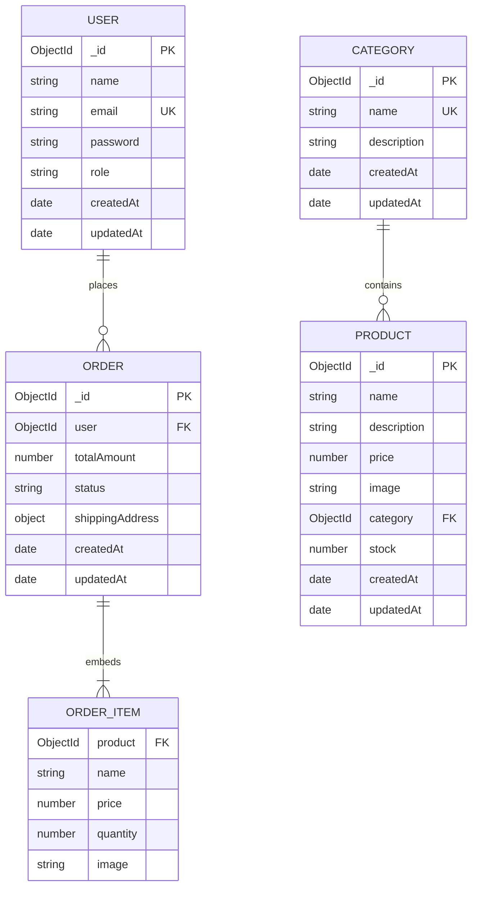

# 💾 Database Models & Schema Design

This document details the MongoDB data models, Mongoose schemas, relationships, indexing strategies, and lifecycle hooks for the **Mini E-Commerce Demo Project**.

---

## 📋 Table of Contents

- [1. Entity Relationship (ER) Diagram](#1-entity-relationship-er-diagram)
- [2. User Model (`User.js`)](#2-user-model-userjs)
- [3. Category Model (`Category.js`)](#3-category-model-categoryjs)
- [4. Product Model (`Product.js`)](#4-product-model-productjs)
- [5. Order Model (`Order.js`)](#5-order-model-orderjs)
- [6. Indexing & Query Optimization](#6-indexing--query-optimization)
- [7. Data Integrity & Snapshots](#7-data-integrity--snapshots)

---

## 1. Entity Relationship (ER) Diagram



---

## 2. User Model (`User.js`)

The `User` collection manages customer profiles and administrative access.

### Schema Attributes

| Field | Type | Required | Constraints / Default | Description |
| :--- | :--- | :--- | :--- | :--- |
| `name` | `String` | Yes | Trimmed, Max 60 chars | User's full name |
| `email` | `String` | Yes | Unique, Lowercase, Regex Match | Primary account identifier |
| `password` | `String` | Yes | Min 6 chars (hashed) | Salted bcrypt hash |
| `role` | `String` | Yes | Enum: `['customer', 'admin']`, Default: `'customer'` | Authorization role |
| `timestamps` | `Date` | Auto | Managed by Mongoose | `createdAt` & `updatedAt` |

### Mongoose Implementation Blueprint

```javascript
import mongoose from 'mongoose';
import bcrypt from 'bcryptjs';

const userSchema = new mongoose.Schema(
  {
    name: {
      type: String,
      required: [true, 'Name is required'],
      trim: true,
      maxlength: [60, 'Name cannot exceed 60 characters']
    },
    email: {
      type: String,
      required: [true, 'Email is required'],
      unique: true,
      trim: true,
      lowercase: true,
      match: [
        /^\w+([\.-]?\w+)*@\w+([\.-]?\w+)*(\.\w{2,3})+$/,
        'Please provide a valid email address'
      ]
    },
    password: {
      type: String,
      required: [true, 'Password is required'],
      minlength: [6, 'Password must be at least 6 characters']
    },
    role: {
      type: String,
      enum: ['customer', 'admin'],
      default: 'customer'
    }
  },
  {
    timestamps: true
  }
);

// Pre-save hook: Hash password using bcryptjs before persisting
userSchema.pre('save', async function (next) {
  if (!this.isModified('password')) {
    return next();
  }
  const salt = await bcrypt.genSalt(10);
  this.password = await bcrypt.hash(this.password, salt);
  next();
});

// Instance method: Validate password candidate
userSchema.methods.matchPassword = async function (enteredPassword) {
  return await bcrypt.compare(enteredPassword, this.password);
};

export default mongoose.model('User', userSchema);
```

---

## 3. Category Model (`Category.js`)

The `Category` collection provides taxonomy for organizing products.

### Schema Attributes

| Field | Type | Required | Constraints / Default | Description |
| :--- | :--- | :--- | :--- | :--- |
| `name` | `String` | Yes | Unique, Trimmed, Max 50 chars | Category name (e.g. Electronics) |
| `description` | `String` | No | Trimmed, Max 250 chars | Brief summary of category |
| `timestamps` | `Date` | Auto | Managed by Mongoose | `createdAt` & `updatedAt` |

### Mongoose Implementation Blueprint

```javascript
import mongoose from 'mongoose';

const categorySchema = new mongoose.Schema(
  {
    name: {
      type: String,
      required: [true, 'Category name is required'],
      unique: true,
      trim: true,
      maxlength: [50, 'Category name cannot exceed 50 characters']
    },
    description: {
      type: String,
      trim: true,
      default: '',
      maxlength: [250, 'Description cannot exceed 250 characters']
    }
  },
  {
    timestamps: true
  }
);

export default mongoose.model('Category', categorySchema);
```

---

## 4. Product Model (`Product.js`)

The `Product` collection represents inventory items available for purchase.

### Schema Attributes

| Field | Type | Required | Constraints / Default | Description |
| :--- | :--- | :--- | :--- | :--- |
| `name` | `String` | Yes | Trimmed, Max 120 chars | Product display title |
| `description` | `String` | Yes | Trimmed | Detailed item description |
| `price` | `Number` | Yes | Min: `0.01` | Unit price in USD / Local currency |
| `image` | `String` | Yes | Trimmed, Valid URI format | URL to the product cover image |
| `category` | `ObjectId` | Yes | Reference to `Category` | Parent category reference |
| `stock` | `Number` | Yes | Integer, Min: `0`, Default: `0` | Available quantity in warehouse |
| `timestamps` | `Date` | Auto | Managed by Mongoose | `createdAt` & `updatedAt` |

### Mongoose Implementation Blueprint

```javascript
import mongoose from 'mongoose';

const productSchema = new mongoose.Schema(
  {
    name: {
      type: String,
      required: [true, 'Product name is required'],
      trim: true,
      maxlength: [120, 'Product name cannot exceed 120 characters']
    },
    description: {
      type: String,
      required: [true, 'Product description is required'],
      trim: true
    },
    price: {
      type: Number,
      required: [true, 'Product price is required'],
      min: [0.01, 'Price must be greater than zero']
    },
    image: {
      type: String,
      required: [true, 'Product image URL is required'],
      trim: true
    },
    category: {
      type: mongoose.Schema.Types.ObjectId,
      ref: 'Category',
      required: [true, 'Category is required']
    },
    stock: {
      type: Number,
      required: [true, 'Product stock is required'],
      min: [0, 'Stock cannot be negative'],
      default: 0
    }
  },
  {
    timestamps: true
  }
);

// Text Index for full-text search capability
productSchema.index({ name: 'text', description: 'text' });

export default mongoose.model('Product', productSchema);
```

---

## 5. Order Model (`Order.js`)

The `Order` collection stores customer purchases and fulfillment status.

### Schema Attributes

| Field | Type | Required | Constraints / Default | Description |
| :--- | :--- | :--- | :--- | :--- |
| `user` | `ObjectId` | Yes | Reference to `User` | Customer who placed order |
| `products` | `Array` | Yes | Array of OrderItem subdocuments | Line items purchased |
| `totalAmount` | `Number` | Yes | Min: `0.01` | Final calculated order price |
| `shippingAddress` | `Object` | Yes | Subdocument | Delivery address details |
| `status` | `String` | Yes | Enum, Default: `'Pending'` | Current order state |
| `paymentMethod` | `String` | Yes | Default: `'Cash on Delivery'` | Mode of payment |
| `timestamps` | `Date` | Auto | Managed by Mongoose | `createdAt` & `updatedAt` |

### Order Item Subdocument

```javascript
{
  product: {
    type: mongoose.Schema.Types.ObjectId,
    ref: 'Product',
    required: true
  },
  name: { type: String, required: true },
  price: { type: Number, required: true },
  quantity: { type: Number, required: true, min: 1 },
  image: { type: String, required: true }
}
```

### Shipping Address Subdocument

```javascript
{
  name: { type: String, required: true, trim: true },
  phone: { type: String, required: true, trim: true },
  address: { type: String, required: true, trim: true },
  city: { type: String, required: true, trim: true },
  pincode: { type: String, required: true, trim: true }
}
```

### Mongoose Implementation Blueprint

```javascript
import mongoose from 'mongoose';

const orderItemSchema = new mongoose.Schema(
  {
    product: {
      type: mongoose.Schema.Types.ObjectId,
      ref: 'Product',
      required: true
    },
    name: { type: String, required: true },
    price: { type: Number, required: true },
    quantity: { type: Number, required: true, min: 1 },
    image: { type: String, required: true }
  },
  { _id: false }
);

const shippingAddressSchema = new mongoose.Schema(
  {
    name: { type: String, required: [true, 'Recipient name is required'], trim: true },
    phone: { type: String, required: [true, 'Phone number is required'], trim: true },
    address: { type: String, required: [true, 'Street address is required'], trim: true },
    city: { type: String, required: [true, 'City is required'], trim: true },
    pincode: { type: String, required: [true, 'Pincode is required'], trim: true }
  },
  { _id: false }
);

const orderSchema = new mongoose.Schema(
  {
    user: {
      type: mongoose.Schema.Types.ObjectId,
      ref: 'User',
      required: true
    },
    products: {
      type: [orderItemSchema],
      required: true,
      validate: [val => val.length > 0, 'Order must contain at least one product']
    },
    totalAmount: {
      type: Number,
      required: true,
      min: [0.01, 'Total amount must be greater than zero']
    },
    shippingAddress: {
      type: shippingAddressSchema,
      required: true
    },
    status: {
      type: String,
      enum: ['Pending', 'Confirmed', 'Shipped', 'Delivered', 'Cancelled'],
      default: 'Pending'
    },
    paymentMethod: {
      type: String,
      default: 'Cash on Delivery'
    }
  },
  {
    timestamps: true
  }
);

// Indexes for order querying
orderSchema.index({ user: 1, createdAt: -1 });
orderSchema.index({ status: 1 });

export default mongoose.model('Order', orderSchema);
```

---

## 6. Indexing & Query Optimization

| Collection | Indexed Field(s) | Type | Purpose |
| :--- | :--- | :--- | :--- |
| **User** | `email` | Unique Ascending | Prevents duplicate user accounts and speeds up login queries |
| **Category**| `name` | Unique Ascending | Ensures unique category names and speeds up filtering |
| **Product** | `category` | Ascending | Accelerates category filter lookups (`/api/products?category=...`) |
| **Product** | `{ name: 'text', description: 'text' }` | Full-Text | Powers fast keyword search queries across catalog items |
| **Order** | `{ user: 1, createdAt: -1 }` | Compound | Fast sorting for customer's "My Orders" view |
| **Order** | `status` | Ascending | Fast administrative filtering by order lifecycle state |

---

## 7. Data Integrity & Snapshots

1. **Snapshotting**: The `Order.products` array duplicates the `name`, `price`, and `image` at the moment of purchase. If the product is later repriced or deleted from the catalog, customer receipts and historic sales metrics remain unmodified.
2. **Atomic Inventory Decrement**:
   ```javascript
   await Product.updateOne(
     { _id: item.product, stock: { $gte: item.quantity } },
     { $inc: { stock: -item.quantity } }
   );
   ```
   Ensures that concurrent purchases never cause negative stock.
