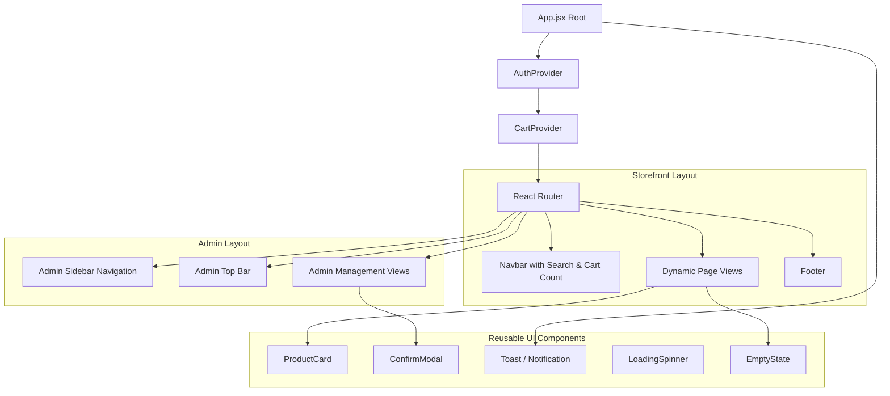

# 🎨 Frontend & UI/UX Specification

This document provides the UI architecture, Tailwind CSS design system, component hierarchy, page layouts, interactive states, and UX conventions for the **React + Vite** client application.

---

## 📋 Table of Contents

- [1. Design System & Styling (Tailwind CSS)](#1-design-system--styling-tailwind-css)
  - [1.1 Color Palette](#11-color-palette)
  - [1.2 Typography & Shadows](#12-typography--shadows)
  - [1.3 Responsive Breakpoints](#13-responsive-breakpoints)
- [2. Component Architecture](#2-component-architecture)
  - [2.1 Common Components](#21-common-components)
  - [2.2 Storefront Components](#22-storefront-components)
  - [2.3 Admin Components](#23-admin-components)
- [3. Page Specifications](#3-page-specifications)
  - [3.1 Home Page (`/`)](#31-home-page-)
  - [3.2 Products Catalog (`/products`)](#32-products-catalog-products)
  - [3.3 Product Details (`/products/:id`)](#33-product-details-productsid)
  - [3.4 Shopping Cart (`/cart`)](#34-shopping-cart-cart)
  - [3.5 Checkout (`/checkout`)](#35-checkout-checkout)
  - [3.6 Customer Orders (`/my-orders`)](#36-customer-orders-my-orders)
  - [3.7 Authentication Pages (`/login` & `/register`)](#37-authentication-pages-login--register)
  - [3.8 Admin Management Views](#38-admin-management-views)
- [4. Micro-Interactions & Feedback States](#4-micro-interactions--feedback-states)
  - [4.1 Loading Skeletons & Spinners](#41-loading-skeletons--spinners)
  - [4.2 Empty States](#42-empty-states)
  - [4.3 Toast Notifications](#43-toast-notifications)
  - [4.4 Delete Confirmation Modal](#44-delete-confirmation-modal)

---

## 1. Design System & Styling (Tailwind CSS)

The project leverages a clean, modern aesthetic focusing on clarity, whitespace, accessibility, and intuitive shopping workflows.

### 1.1 Color Palette

| Role | Tailwind Classes | Hex / Purpose |
| :--- | :--- | :--- |
| **Primary Brand** | `bg-indigo-600 hover:bg-indigo-700 text-white` | Primary actions, CTA buttons, active tabs |
| **Secondary Accent** | `bg-slate-900 text-white`, `bg-amber-500` | Badges, highlighted labels, star ratings |
| **Neutral Backgrounds**| `bg-slate-50`, `bg-white`, `bg-slate-100` | Card surfaces, modals, body background |
| **Borders & Dividers**| `border-slate-200`, `border-slate-300` | Clean structural dividing lines |
| **Typography Dark** | `text-slate-900`, `text-slate-800` | Headings, titles, high-emphasis text |
| **Typography Muted** | `text-slate-500`, `text-slate-600` | Secondary metadata, descriptions, prices |
| **Success State** | `bg-emerald-50 text-emerald-700 border-emerald-200` | Delivered badge, success toast |
| **Warning State** | `bg-amber-50 text-amber-700 border-amber-200` | Pending status, low stock indicator |
| **Danger State** | `bg-rose-50 text-rose-700 border-rose-200` | Cancelled status, delete button, errors |

### 1.2 Typography & Shadows

- **Font Family**: Modern sans-serif stack (`Inter`, `system-ui`, `-apple-system`, `sans-serif`).
- **Elevations**:
  - Cards: `shadow-sm hover:shadow-md transition-shadow duration-200`
  - Floating Modals: `shadow-xl`
  - Dropdowns: `shadow-lg border border-slate-100`

### 1.3 Responsive Breakpoints

- **Mobile** (`< 640px`): Single column grids, collapsible mobile drawer/navbar, bottom-sheet style cards.
- **Tablet** (`640px - 1024px`): 2-column product catalog, compact admin tables.
- **Desktop** (`> 1024px`): 3 to 4-column product grid, fixed sidebar admin navigation, split-screen checkout.

---

## 2. Component Architecture

### 2.1 Common Components

- **`Navbar.jsx`**:
  - Sticky top layout with blur backdrop (`backdrop-blur-md bg-white/90`).
  - Brand logo with link to Home.
  - Global search input with instant navigation to `/products?search=...`.
  - Category quick navigation dropdown.
  - Cart icon with dynamic numeric badge count.
  - User profile menu: Customer Name, "My Orders", "Admin Panel" (if admin), and "Logout".
- **`Footer.jsx`**:
  - Responsive 3-column layout: About, Quick Links, and Contact / COD Notice.
- **`Modal.jsx` / `ConfirmModal.jsx`**:
  - Backdrop overlay with smooth fade-in animation.
  - Focus trapping and ESC key dismissal.
  - Clear "Cancel" vs destructive "Confirm Delete" actions.
- **`Toast.jsx`**:
  - Auto-dismissing notifications for Cart additions, Order placement, and API errors.

### 2.2 Storefront Components

- **`ProductCard.jsx`**:
  - Aspect-ratio locked image container (`aspect-square overflow-hidden bg-slate-100`).
  - Category pill badge (`text-xs font-medium text-indigo-600 bg-indigo-50 px-2.5 py-0.5 rounded-full`).
  - Product title with 2-line clamping.
  - Price display (`$XX.XX`).
  - Stock badge:
    - `In Stock (X available)` in green.
    - `Out of Stock` in red (disables Add to Cart button).
  - Quick action: "Add to Cart" button with cart icon.
- **`CategoryFilterBar.jsx`**:
  - Horizontal scrolling pill buttons: `All`, `Electronics`, `Fashion`, `Shoes`, etc.
  - Visual active state with smooth transition.

### 2.3 Admin Components

- **`AdminSidebar.jsx`**:
  - Persistent vertical navigation on desktop:
    - Dashboard Overview
    - Category Management
    - Product Management
    - Order Management
    - Back to Storefront Link
- **`AdminTable.jsx`**:
  - Clean responsive table with zebra hover rows (`hover:bg-slate-50`).
  - Badges for status and inventory counts.
  - Action column with Edit and Delete icons.

---

## 3. Page Specifications

### 3.1 Home Page (`/`)
- **Hero Section**: High-impact banner with clear value proposition and "Shop Catalog" CTA.
- **Featured Categories**: Interactive cards linking directly to pre-filtered catalog views.
- **Latest Products**: 4-8 newest product cards with direct "Add to Cart" capability.
- **Feature Badges**: 100% Cash on Delivery, Fast Shipping, Easy Order Tracking.

### 3.2 Products Catalog (`/products`)
- **Controls Bar**:
  - Search input box with clear button.
  - Horizontal category filter buttons (`All | Electronics | Fashion | Shoes`).
  - Active filter chips and total results count.
- **Grid View**:
  - `grid grid-cols-1 sm:grid-cols-2 md:grid-cols-3 lg:grid-cols-4 gap-6`.
  - Empty state when no products match search or category criteria.

### 3.3 Product Details (`/products/:id`)
- **Layout**: 2-column desktop split view.
  - Left: Large product image with subtle rounded frame.
  - Right: Category pill, Product Title (`text-3xl font-bold`), Price (`text-2xl text-indigo-600`), Full description.
  - Quantity Selector: `[ - ] [ quantity ] [ + ]` bounded between `1` and available `stock`.
  - Primary CTA: "Add to Cart" button.

### 3.4 Shopping Cart (`/cart`)
- **Item List**:
  - Thumbnail, Title, Unit Price, and Quantity adjusters.
  - Line total and Remove item icon button (`trash`).
- **Cart Summary Card**:
  - Subtotal calculation.
  - Shipping fee: Free (or standard COD).
  - Estimated Total.
  - "Proceed to Checkout" button.
- **Empty State**: Shown when `cartItems.length === 0` with a "Start Shopping" button.

### 3.5 Checkout (`/checkout`)
- **Shipping Form**:
  - Recipient Full Name (`required`).
  - Contact Phone (`required`, numeric validation).
  - Street Address (`required`).
  - City (`required`).
  - Postal Pincode (`required`).
- **Payment Method**:
  - Static selected option: **Cash on Delivery (COD)** with explanatory badge.
- **Order Summary Sidebar**:
  - Mini breakdown of items being purchased.
  - Final total amount.
  - "Place Order (Cash on Delivery)" primary button with loading spinner state.

### 3.6 Customer Orders (`/my-orders`)
- **Order Cards List**:
  - Order ID & placement date (`Order #... placed on Oct 2, 2026`).
  - Status Badge with color coding:
    - `Pending`: Yellow badge
    - `Confirmed`: Blue badge
    - `Shipped`: Purple badge
    - `Delivered`: Green badge
    - `Cancelled`: Red badge
  - Products purchased in the order (thumbnails, titles, quantities, unit prices).
  - Shipping address preview.
  - Total Order Price.

### 3.7 Authentication Pages (`/login` & `/register`)
- **Clean centered card** (`max-w-md mx-auto my-12 bg-white p-8 rounded-xl shadow-md border`).
- **Fields with instant feedback**:
  - Registration: Full Name, Email, Password, Confirm Password.
  - Login: Email, Password.
- Seamless redirection: Redirects admin to `/admin`, customer back to previous route or storefront.

### 3.8 Admin Management Views

#### Admin Dashboard (`/admin`)
- Metric summary tiles:
  - Total Orders
  - Total Products Cataloged
  - Total Categories
  - Pending Orders Count
- Quick shortcut actions to Add Product and Manage Orders.

#### Admin Categories (`/admin/categories`)
- Table displaying: Name, Description, Creation Date, Actions (Edit / Delete).
- "Add Category" modal with Name and Description inputs.
- Confirmation dialog before deleting any category.

#### Admin Products (`/admin/products`)
- Table displaying: Thumbnail, Name, Category Name, Price, Stock count, Actions (Edit / Delete).
- "Add / Edit Product" modal form:
  - Title, Description, Category Dropdown, Price, Stock, Image URL with live preview thumbnail.

#### Admin Orders (`/admin/orders`)
- Table displaying: Order ID, Customer Name & Email, Date, Total Amount, Current Status, Action Dropdown.
- Inline status selector dropdown (`Pending`, `Confirmed`, `Shipped`, `Delivered`, `Cancelled`) triggering immediate PATCH request.

---

## 4. Micro-Interactions & Feedback States

### 4.1 Loading Skeletons & Spinners
- Skeleton pulse animations (`animate-pulse bg-slate-200 rounded`) during initial data fetching on Product grids and tables to prevent layout shift.
- Button spinners during async actions (Login, Register, Place Order).

### 4.2 Empty States
- Custom illustrated SVG or clean icons with helpful messaging for:
  - No products found in category/search.
  - Shopping cart is currently empty.
  - No orders placed yet.

### 4.3 Toast Notifications
- Crisp notification toasts appearing at the top-right corner:
  - `"Product added to cart!"`
  - `"Order placed successfully!"`
  - `"Category deleted successfully!"`
  - Error messages from API responses.

### 4.4 Delete Confirmation Modal
- Intercepts destructive actions in the Admin panel.
- Clearly states the resource being removed and requires affirmative button click before firing API call.
