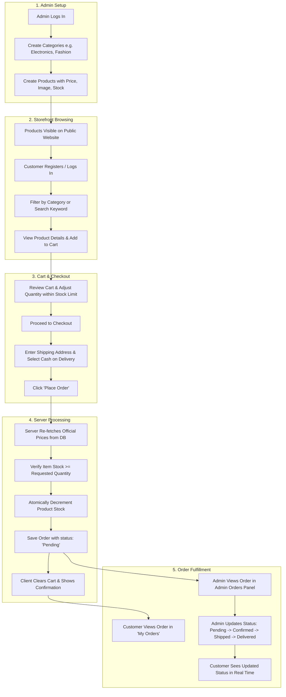

# 🛡️ Workflows, Security & Validation Rules

This document outlines the end-to-end demo operational workflows, client and server-side validation matrix, and the security rules governing the **Mini E-Commerce Demo Project**.

---

## 📋 Table of Contents

- [1. End-to-End Demo Operational Workflow](#1-end-to-end-demo-operational-workflow)
  - [Step 1: Admin Initialization & Setup](#step-1-admin-initialization--setup)
  - [Step 2: Category & Product Catalog Creation](#step-2-category--product-catalog-creation)
  - [Step 3: Customer Registration & Login](#step-3-customer-registration--login)
  - [Step 4: Browsing, Search & Filter](#step-4-browsing-search--filter)
  - [Step 5: Shopping Cart Management](#step-5-shopping-cart-management)
  - [Step 6: Checkout & Order Creation](#step-6-checkout--order-creation)
  - [Step 7: Admin Inspection & Order Status Lifecycle](#step-7-admin-inspection--order-status-lifecycle)
- [2. Security Architecture & Critical Rules](#2-security-architecture--critical-rules)
  - [Rule 1: Never Trust Frontend Prices](#rule-1-never-trust-frontend-prices)
  - [Rule 2: Inventory & Stock Integrity](#rule-2-inventory--stock-integrity)
  - [Rule 3: Password Encryption with bcrypt](#rule-3-password-encryption-with-bcrypt)
  - [Rule 4: JWT Authentication & Secret Signing](#rule-4-jwt-authentication--secret-signing)
  - [Rule 5: Role-Based Authorization Guard](#rule-5-role-based-authorization-guard)
- [3. Validation Matrix](#3-validation-matrix)
  - [3.1 User & Auth Validation](#31-user--auth-validation)
  - [3.2 Category Validation](#32-category-validation)
  - [3.3 Product Validation](#33-product-validation)
  - [3.4 Order & Shipping Validation](#34-order--shipping-validation)

---

## 1. End-to-End Demo Operational Workflow



### Step 1: Admin Initialization & Setup
1. A seed script or initial registration creates an administrator account (`role: 'admin'`).
2. Admin logs in via `/login` with administrative credentials.
3. Upon receiving the JWT with `role: 'admin'`, the client navigates to the Admin Panel (`/admin`).

### Step 2: Category & Product Catalog Creation
1. Admin navigates to `/admin/categories` and adds categories (e.g., *Electronics*, *Fashion*, *Shoes*).
2. Admin navigates to `/admin/products` and adds products, selecting a category from the dropdown, assigning price, stock level, and image URL.

### Step 3: Customer Registration & Login
1. Customer visits the public storefront and registers at `/register`.
2. Frontend verifies that `password === confirmPassword` and length >= 6.
3. Backend checks that email is unique, hashes password via `bcrypt`, and responds with a JWT token.

### Step 4: Browsing, Search & Filter
1. Customer visits `/products`.
2. Clicks category filter pills (`Electronics`, `Fashion`, etc.) triggering `GET /api/products?category=Electronics`.
3. Types a search query (e.g., `"phone"`), updating the URL and triggering `GET /api/products?search=phone`.
4. Clicks any product card to see the detailed description and live stock level on `/products/:id`.

### Step 5: Shopping Cart Management
1. Customer clicks "Add to Cart".
2. If quantity in cart reaches available stock, the UI disables the `+` button and shows a friendly badge.
3. Cart persists across page reloads via `localStorage`.

### Step 6: Checkout & Order Creation
1. Customer navigates to `/checkout`.
2. Fills out delivery address (Name, Phone, Address, City, Pincode).
3. Payment method displays **Cash on Delivery (COD)**.
4. Customer clicks **"Place Order"**.
5. Server performs stock validation, pulls prices from the database, computes `totalAmount`, decrements stock, and saves the order.
6. Frontend clears cart and redirects customer to `/my-orders`.

### Step 7: Admin Inspection & Order Status Lifecycle
1. Admin opens `/admin/orders` and observes the newly placed order.
2. Admin inspects items, total amount, and delivery address.
3. Admin transitions status: `Pending` ➔ `Confirmed` ➔ `Shipped` ➔ `Delivered`.
4. Customer refreshes `/my-orders` and observes the updated status badge.

---

## 2. Security Architecture & Critical Rules

### Rule 1: Never Trust Frontend Prices
> [!CAUTION]
> Under no circumstances may the client dictate the item price or order total sent to the backend.

- The client payload only transmits `{ product: productId, quantity: number }`.
- The server queries each product document directly from MongoDB:
  ```javascript
  const product = await Product.findById(item.product);
  const authoritativePrice = product.price;
  const lineTotal = authoritativePrice * item.quantity;
  calculatedTotal += lineTotal;
  ```
- This prevents malicious users from spoofing request bodies with altered prices.

### Rule 2: Inventory & Stock Integrity
- **Boundary Guards**:
  - The client UI disables the increment button once cart quantity equals available stock.
  - The server verifies available stock before processing any order:
    ```javascript
    if (product.stock < item.quantity) {
      return res.status(400).json({
        success: false,
        message: `Insufficient stock for ${product.name}. Available: ${product.stock}, Requested: ${item.quantity}`
      });
    }
    ```
- **Atomic Stock Decrement**:
  ```javascript
  await Product.findByIdAndUpdate(item.product, {
    $inc: { stock: -item.quantity }
  });
  ```

### Rule 3: Password Encryption with bcrypt
- Passwords are never stored in plaintext.
- Passwords are salted with 10 rounds using `bcryptjs` in a Mongoose `pre('save')` hook:
  ```javascript
  const salt = await bcrypt.genSalt(10);
  this.password = await bcrypt.hash(this.password, salt);
  ```
- Authentication compares plaintext candidates using constant-time comparison `bcrypt.compare`.

### Rule 4: JWT Authentication & Secret Signing
- Tokens are signed with a server-side `JWT_SECRET` and expiration (e.g., `30d`):
  ```javascript
  jwt.sign({ id: user._id, role: user.role }, process.env.JWT_SECRET, { expiresIn: '30d' });
  ```
- Tokens are parsed and verified using `authMiddleware`:
  ```javascript
  const decoded = jwt.verify(token, process.env.JWT_SECRET);
  req.user = await User.findById(decoded.id).select('-password');
  ```

### Rule 5: Role-Based Authorization Guard
- Protected administrative endpoints are guarded by `adminMiddleware`:
  ```javascript
  const adminOnly = (req, res, next) => {
    if (req.user && req.user.role === 'admin') {
      next();
    } else {
      res.status(403).json({ success: false, message: 'Access denied: Admin privileges required' });
    }
  };
  ```

---

## 3. Validation Matrix

| Entity | Field | Frontend Validation | Backend Validation |
| :--- | :--- | :--- | :--- |
| **User** | `name` | Required, trimmed, max 60 chars | `required: true`, `maxlength: 60`, `trim: true` |
| **User** | `email` | Required, valid email regex pattern | `required: true`, `unique: true`, regex match, lowercase |
| **User** | `password` | Required, min 6 characters | `required: true`, `minlength: 6`, bcrypt hashed |
| **User** | `confirmPassword` | Must match `password` field | Checked in registration controller |
| **Category** | `name` | Required, min 2, max 50 chars | `required: true`, `unique: true`, `trim: true` |
| **Category** | `description` | Optional, max 250 chars | `maxlength: 250`, `trim: true` |
| **Product** | `name` | Required, trimmed, max 120 chars | `required: true`, `trim: true`, `maxlength: 120` |
| **Product** | `description` | Required, non-empty string | `required: true`, `trim: true` |
| **Product** | `price` | Required, number > 0 | `required: true`, `min: [0.01, 'Price must be > 0']` |
| **Product** | `image` | Required, valid URL | `required: true`, `trim: true` |
| **Product** | `category` | Required selection | `required: true`, valid Category `ObjectId` |
| **Product** | `stock` | Required, integer >= 0 | `required: true`, `min: [0, 'Stock cannot be negative']` |
| **Order** | `products` | Cart must have at least 1 item | Array non-empty check, verify each product exists |
| **Order** | `shippingAddress.name` | Required string | Required subdocument field |
| **Order** | `shippingAddress.phone`| Required, valid numeric/phone pattern | Required subdocument field |
| **Order** | `shippingAddress.address`| Required string | Required subdocument field |
| **Order** | `shippingAddress.city` | Required string | Required subdocument field |
| **Order** | `shippingAddress.pincode`| Required string | Required subdocument field |
| **Order** | `status` | Read-only for customer | Enum: `['Pending', 'Confirmed', 'Shipped', 'Delivered', 'Cancelled']` |
